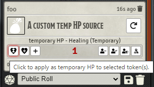
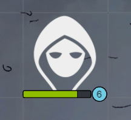

# Better Temp HP 5e

Adds ease of use and quality of life enhancements for using temporary hitpoints under the betterrolls5e module.

### Setting Temporary HP

Adds a new button to the damage overlay buttons on the chat card, allowing any formula output to be applied as temporary HP.

### Displaying Temporary HP

When a token has temporary HP, adds a callout to the tokens HP bar displaying how much temporary HP it has. When this bubble is present, the standard HP bar is scaled, so no information is hidden.

When the token loses all its temporary HP, the bubble is removed and the HP bar is returned to full scale.

